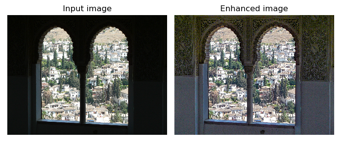
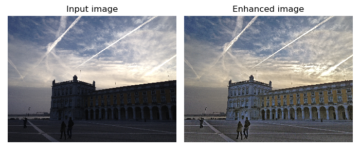
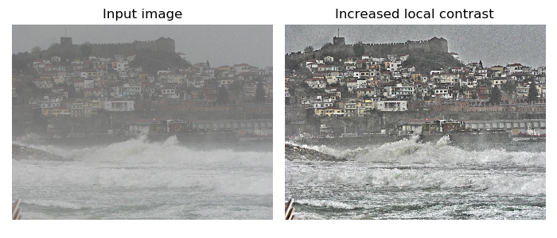
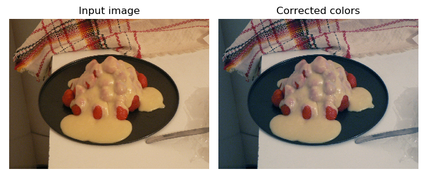
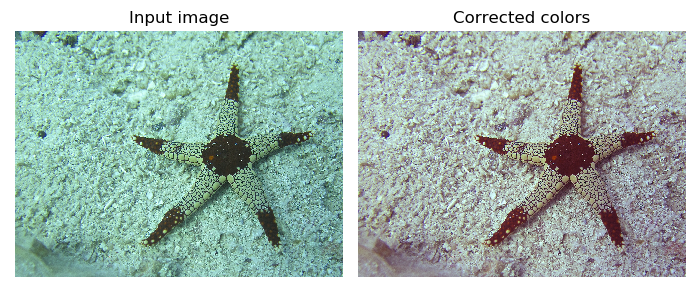
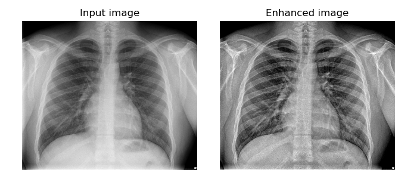

# image_enhancement
Library of NumPy functions for various types of image enhancement, including:
- Spatial Tone Mapping
- Local Contrast Enhencement
- Color Correction (white balance)
- Color Saturation Adjustment

All 

# Dependences
- numpy
- imageio
- skimage (can be easily bypassed)

# Citations
If you use this code in your research please cite the following papers:   
1. [Vonikakis, V., Andreadis, I., & Gasteratos, A. (2008). Fast centre-surround contrast modification. IET Image processing 2(1), 19-34.](https://www.researchgate.net/publication/3481092_Fast_centre-surround_contrast_modification)
2. [Vonikakis, V., Winkler, S. (2016). A center-surround framework for spatial image processing. Proc. IS&T Human Vision & Electronic Imaging, (Retinex020), San Francisco, CA, Feb. 14-18.](http://vintage.winklerbros.net/Publications/ei2016hvei.pdf)
3. [Vonikakis, V., Arapakis, I. & Andreadis, I. (2011).Combining Gray-World assumption, White-Point correction and power transformation for automatic white balance. International Workshop on Advanced Image Technology (IWAIT), 1569353295.](https://www.researchgate.net/publication/235350557_Combining_Gray-World_assumption_White-Point_correction_and_power_transformation_for_automatic_white_balance)
